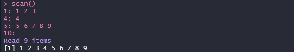
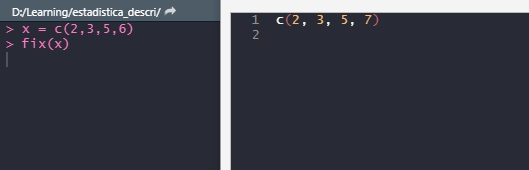

```{r setup, include=FALSE}
knitr::opts_chunk$set(echo = TRUE)
```

## Vectores
Los vectores son agrupaciones de elementos del mismo tipo de dato, los tipos de datos en R son los siguientes:

- logical: TRUE o FALSE
- integer: enteros
- numeric: reales
- complex: conplejos
- character: palabras

Las agrupaciones de elementos con diferentes tipos de datos se llaman listas generalizadas.

Si se pone en un  vector diferentes tipos de datos, los datos se convierten al de mayor jerarquía, los datos mostrados anteriormente están listados de menor a mayor jerarquía.

```{r}
# todos se convierten a character en este vector
c(1, "dos", 3, TRUE)

# todos se conviernen a numeric en este vector
c(1, 3.5, TRUE, 8)
```


Para definir un vector se usan las siguientes notaciones:

```{r}
c(2, 3, 5, 7)
rep(TRUE, 6)
```

```{r}
# scan()
```


```{r}
# fix()
```


### Secuencias Aritmeticas
```{r}
seq(1,5)
```

Asimismo una secuencia con una razon determinada
```{r}
# secuencia de 5 a 25 con razon 5
seq(5, 25, by = 5)
```

Secuencias con numero de elementos indicados
```{r}
seq(1,25, length.out = 9)
```

Secuencia con numero de elementos y razon indicadas
```{r}
seq(2, by = 3, length.out = 10)
```

### Aplicando funciones a vectores
```{r}
x = 1:10
x
# suma de elementos
sum(x)

# multiplicacion de elementos
prod(x)

# minimo de elementos
min(x)

# maximo de elementos
max(x)

# media de los elemetos
mean(x)

# sumas acummuladas
cumsum(x)

# operaciones
x^2
x + 2
sqrt(x)
x^x

# ordenar vectores
arr = c(2,8,4,6,3,15,2,4,13)
arr

sort(arr)

sort(rev(arr))

rev(sort(arr))

sort(arr, decreasing = TRUE)

# longitud del vector
length(arr)
```


